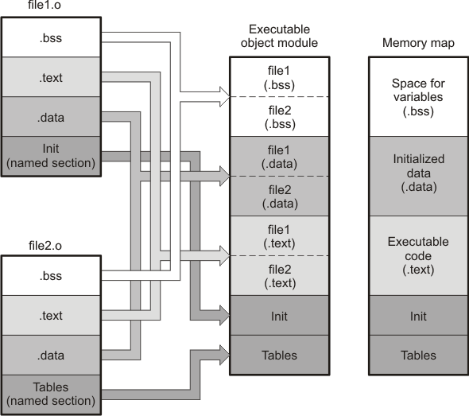

# Стек и вызов функций / aarch64

Как обычно, ридинги: 
- [Яковлев](https://github.com/victor-yacovlev/fpmi-caos/tree/master/practice/aarch64-functions)


Ссылки:
 - https://habr.com/ru/post/197854/  про Арм64
 - https://habr.com/ru/post/106107/ про линковку динамических библиотек

## Про флаги в асме при арифм операциях
На прошлом семинаре была допущена неточность на тему флагов.

Флаги будут считаться при использовании операции сравнения (`cmp` например), или при использовании арифметической операции с суффиксом s (`adds` например).

## `.data` + линковщик

Как было упомянуто в прошлый раз, у ассемблера есть несколько важных секций. Важно помнить названия и предназначения самых часто-используемых:  
- `.text`
- `.data`
- `.rodata`
- `.bss`  

Если вы не помните зачем они нужны, приглашаю вас ещё раз просмотреть какой-то ридинг, где эти вещи объясняются (это может попасться на контрольной). Чуть больше про директивы секций https://developer.arm.com/documentation/100067/0612/armclang-Integrated-Assembler/Section-directives?lang=en.

Тем, кому интересно, можете почитать про то как ассемблер справляется с компиляцией секций [тут](https://software-dl.ti.com/codegen/docs/tiarmclang/compiler_tools_user_guide/compiler_manual/intro_to_object_modules/how-the-assembler-handles-sections-stdz0693935-add.html).

Познакомимся с инструкцией ADR 
https://developer.arm.com/documentation/dui0473/m/arm-and-thumb-instructions/adr--register-relative-

Про то что можно писать в секции .data
https://developer.arm.com/documentation/100067/0612/armclang-Integrated-Assembler/Data-definition-directives

Мы же сегодня чуть подробнее остановимся на взаимодействие секции `.data` c секцией `.text` и попробуем чуть поглядеть на то как устроена работа (в основном компилятора) с ними.

Примеры для этой части доступны в папочке [`./data-section`](./data-section/). 

В секции `.data` находятся глобальные и статические переменные нашей програмулины. Для начала, хотелось бы чтобы вы поверили что я не из воздуха эти секции беру. Поэтому мы возьмём, скомпилим нехитрый код на сях и посмотрим во что он у нас скомпилируется. 


Код вот такой:
```c
#include <stdio.h>

int some_variable = 15;

int main() {
  printf("some_variable=%d\n", some_variable);
  return 0;
}
```

Расчехлим `objdump` (к которому я надеюсь мы начинаем уже по-тихоньку привыкать) и посмотрим на `objdump -D a.out`:
```
Disassembly of section .text:

0000000000000754 <main>:
 //...
 75c:   b0000080        adrp    x0, 11000 <__data_start>
 760:   91004000        add     x0, x0, #0x10


Disassembly of section .data:

// всякая хрень

0000000000011010 <some_variable>:
   11010:       0000000f        udf     #15

```


Получается, что не вру и секция `.data` действительно есть и она используется. 

Теперь давайте не линковаться (компилимся с флагом `-c`). Смотрим objdump:

```
Disassembly of section .text:

0000000000000000 <main>:
   0:   a9bf7bfd        stp     x29, x30, [sp, #-16]!
   4:   910003fd        mov     x29, sp
   8:   90000000        adrp    x0, 0 <main> <-- обращаем внимание что адрес тут нулевой! (1)
   c:   91000000        add     x0, x0, #0x0
  10:   b9400000        ldr     w0, [x0]
  14:   2a0003e1        mov     w1, w0
  18:   90000000        adrp    x0, 0 <main>
  1c:   91000000        add     x0, x0, #0x0
  20:   94000000        bl      0 <printf>
  24:   52800000        mov     w0, #0x0                        // #0
  28:   a8c17bfd        ldp     x29, x30, [sp], #16
  2c:   d65f03c0        ret

Disassembly of section .data:

0000000000000000 <some_variable>:
   0:   0000000f        udf     #15      (2)
```

Мораль басни: до этапа линковки компилятор понятия не имеет о **конкретных** адресах тех или иных переменных которые мы собираемся подгрузить и использовать.


Теперь давайте посмотрим на то как этот же принцип работает на нескольких файлах. Предлагаю ознакомиться с файлами `data-section-with-arm.c` и `data-section.S` из папочки [`./data-section`](./data-section).

Запускаем `gcc -с data-section-with-arm.c data-section.S` и смотрим `objdump`.

Обращаем внимание на файлики data-section.o
```
Disassembly of section .text:

0000000000000000 <func>:
   0:   10000003        adr     x3, 0 <func> 
   4:   f9400060        ldr     x0, [x3] 
   8:   10000004        adr     x4, 0 <c_defined>
   c:   f9400081        ldr     x1, [x4]
  10:   91003c21        add     x1, x1, #0xf
  14:   f9000081        str     x1, [x4]
  18:   8b010000        add     x0, x0, x1
  1c:   d65f03c0        ret

```
В строчках кода, в которых у нас было обращение к функциям и переменным, адреса остались нулями. То есть мы узнаем "реальные" (на самом деле нет, но об этом позже) адреса этих переменных уже после того как слинкуемся со всеми файлами. Похожая ситуация будет, если вы посмотрите objdump `data-section-with-arm.o`.

А откуда линковщик знает какие символы надо подменять? Очень просто, `objdump --syms data-section.o`:

Это покажет какие символы и где объявлены в программе. Соответственно, при помощи этой таблицы линковщик и догадывается в каких местах в программе нужно заменять  "нолики" на конкретные адреса.

Ещё можно посмотреть на афигенную картинку, которая нам наглядно помогает понять как работает линковщик:  


## Дополненный список регистров

https://developer.arm.com/documentation/den0024/a/The-ABI-for-ARM-64-bit-Architecture/Register-use-in-the-AArch64-Procedure-Call-Standard/Parameters-in-general-purpose-registers

### Про ~~красивую жизнь~~  ~~`x31`~~ stack pointer
> There is no register called X31 or W31. Many instructions are encoded such that the number 31 represents the zero register, ZR (WZR/XZR). There is also a restricted group of instructаions where one or more of the arguments are encoded such that number 31 represents the Stack Pointer (SP).   
> src: https://developer.arm.com/documentation/den0024/a/ARMv8-Registers/AArch64-special-registers (мануал c1.2.6)

### Выравнивание стека и не только
**Первое правило работы со стеком на aarch64 - стек должен быть выровнен по 16 байт.** Цитируем мануал:
> When stack alignment checking is enabled by system software and the base register is SP, the current stack pointer must be initially quadword aligned, That is, it must be aligned to 16 bytes. Misalignment generates an SP alignment fault.  
> мануал С6.1.2  

Но почему так? 

Во-первых, потому что если делать по-другому, то всё ломается (см. [`./bus-error`](./bus-error)).
Есть и второе (более вменяемое и общее) объснение. Оно доступно в конце файлика, чтобы мы не отвлекались от сути.

**Второе правило - стек растёт вниз** (от адреса больше к адресу меньше). Картинка: 
.

Наконец третье правило работы со стеком - **добавлять нужно столько же сколько отнимали**.

Чтобы работать со стеком, у нас есть "регистр" `sp` - stack pointer. 

### ок ладно поехали ассемблер писать
Первый пример сугубо для того чтобы мы научились пользоваться стек-поинтером + gdb ([`./simple-stack-examples`](./simple-stack-examples/)):
- Подключаем gdb удобным образом и удивляемся тому, что можем смотреть на память при помощи `x/10x $sp`. [ссылка раз](https://visualgdb.com/gdbreference/commands/x) [ссылка два](https://jvns.ca/blog/2021/05/17/how-to-look-at-the-stack-in-gdb/)
- Убеждаемся, что значения, которые у нас прописаны в .S файле действительно (о чудо) оказываются на стеке (при помощи команды дебаггера из списочка выше). 
- Пробуем убрать предпоследнюю строчку и получаем сегфолтом по шапке.

### Вызов printf из assembly
Погнали вызывать printf из ассемблера `./asm-printf`.

- Запускаем без части с сохранением адреса возврата, осознаем что мы сделали глупость, и понимаем насколько важны calling conventions. Здесь присходит примерно следующее -- printf, который мы вызываем, сохраняет свой адрес возврата в регистр x30, а мы когда возвращаемся, его не восстанавливаем со стека, из-за этого происходит неведомая фигня.
- Понимаем что благодаря тем же calling conventions `printf` может понимать какие аргументы в каких регистрах мы передали.
- Ходим пошагово с gdb по коду и смотрим ручками на то как `х30` записывается на стек и читается с него.
- Смотрим как передавать на стеке 8 и дальше аргументы ([`./asm-printf/asm-printf-2.S`](./asm-printf/asm-printf-2.S))


Полезная статья про разные способы работать со стеком на aarch64:
https://community.arm.com/arm-community-blogs/b/architectures-and-processors-blog/posts/using-the-stack-in-aarch64-implementing-push-and-pop

Ещё чуть про стек: 
https://community.arm.com/arm-community-blogs/b/architectures-and-processors-blog/posts/using-the-stack-in-aarch32-and-aarch64
### Виды адресации
Тут две прикольные статьи, в которых подробнее описывается как этим можно пользоваться и зачем это может быть нужно:
- https://devblogs.microsoft.com/oldnewthing/20210602-00/?p=105271
- https://www.cs.uregina.ca/Links/class-info/301/ARM-addressing/lecture.html


Из первой статьи я наглым образом стырил и описал различные виды адресации для aarch64 ассемблера.

Register indirect:
```
ldr r0, [r1]            ; r0 = *r1
```

Register with immediate offset:
```
ldr r0, [r1, #imm]      ; r0 = *(r1 + imm)
ldr r0, [r1, #-imm]     ; r0 = *(r1 - imm)
```

Register with register offset:
```
ldr r0, [r1, r2]        ; r0 = *(r1 + r2)
ldr r0, [r1, -r2]       ; r0 = *(r1 - r2)
```


Pre-indexed:
```
ldr r0, [r1, #4]!           ; r1 = r1 + 4
                            ; r0 = *r1

ldr r0, [r1, r2, lsl #2]!   ; r1 = r1 + (r2 << 2)
                            ; r0 = *r1
```


Post-indexed:
```
ldr r0, [r1], #4            ; r0 = *r1
                            ; r1 = r1 + 4

ldr r0, [r1], r2, lsl #2    ; r0 = *r1
                            ; r1 = r1 + (r2 << 2)
```

### `x16`, `x17`. Veneers, trampolines
Эти регистры обычно используются как трамплины для прыжков в "далёкие" функции. Посмотреть на это можно скомпилировав простую программу с, например, printf-ом и после этого поглядев на objdump

Какие-то ссылки:
https://scienceprog.com/compressed-thumb-instructions-of-arm-mcu/

https://developer.arm.com/documentation/dui0474/m/image-structure-and-generation/linker-generated-veneers/what-is-a-veneer-

https://stackoverflow.com/questions/64893770/what-is-veneer-that-arm-linker-uses-in-function-call

https://topic.alibabacloud.com/a/the-difference-between-the-assembly-jump-instruction-b-bl-bx-blx-and-bxj_8_8_10244895.html

## x8 - структурки 
> X8 is the indirect result register. This is used to pass the address location of an indirect result, for example, where a function returns a large structure.
Чтобы посмотреть как это устроено, нужно скомпилить и посмотреть файл [`struct.c`](./struct.c)

## x18 
X18 is the platform register and is reserved for the use of platform ABIs. This is an additional temporary register on platforms that don't assign a special meaning to it.

<!--
## frame pointer
X29 is the frame pointer register (FP). Если коротко: регистр x30 мы меняем, он указывает на вершину стека, а FP - указатель начало стека, где обычно лежит адрес возврата. 
-->

## link register
X30 is the link register (LR). Мы уже к этому моменту должны понимать почему он важен


## Подробнее про выравнивание
Поговорим про выравнивание, представим себе что мы умеем адресовывать только "слова" размером в 1 байт (так, кстати, когда-то давно было), это означает что за один тик процессора мы можем "обработать" только 8 бит информации.   
Пусть у нас есть некоторые две структурки данных, одна занимает 8 бит, другая занимает 4 бита. Рассмотрим небольшую схемку, на ней условимся первую структуру обозначать единичками, вторую двойками:  
```
+--------+--------+
|11112222|2222----|
+--------+--------+
 ^        ^
 0        8
```

В данном случае мы просто поставили "рядом" эти две структуры. Что будет, если мы знаем адрес второй структуры и нам нужно её прочесть (держа в уме тот факт, что мы за один раз умеем читать только одно 8битное слово)? Получается, что надо будет прочитать два машинных слова и оттуда вытащить нужную нам структурку. Звучит не очень оптимально. Давайте по-другому

```
+--------+--------+
|1111----|22222222|
+--------+--------+
 ^        ^
 0        8
```
Тут получше: чтобы получить доступ ко второй структурке, нам нужен будет всего-лишь один "поход" в память, вместо двух. Получается, что в этой ситуации мы пожертвовали 4 битами ради того, чтобы чтений было меньше.  
Этот же принцип работает, когда речь идёт про выравнивание стека. Выравнивание необходимо, потому что это позволяет компиляторам делать всякие оптимизации и, соответственно, работать существенно быстрее.  


Давайте теперь чуть поиграемся с выравниванием в структурках на си:  
- `struct-alignment/alignment-sizes.c` - можно запустить и посмотреть как меняется размер структурок в зависимости от того в каком порядке стоят поля и проставлен ли `__attribute__((__packed__))`;
- `struct-alignment/dump-read` - можно увидеть как можно дампить и читать кастомные структурки в файлы.
- `struct-alignment/readelf.c` - пишем свой *очень* сырой `readelf` используя приёмчики из `dump-read`.


Тут [про ещё кое-какие преимущества выровненности стека](https://bitcoden.com/answers/why-does-the-x86-64-or-amd64-system-v-abi-mandate-a-16-byte-stack-alignment#:~:text=16%2Dbyte%20alignment%20is%20sometimes,doesn't%20explicitly%20request%20it.). В основном написано про x86, но есть и общие вещи. К тому же х86 ассемблер нам тоже пригодится чуть позже.
https://stackoverflow.com/questions/381244/purpose-of-memory-alignment
