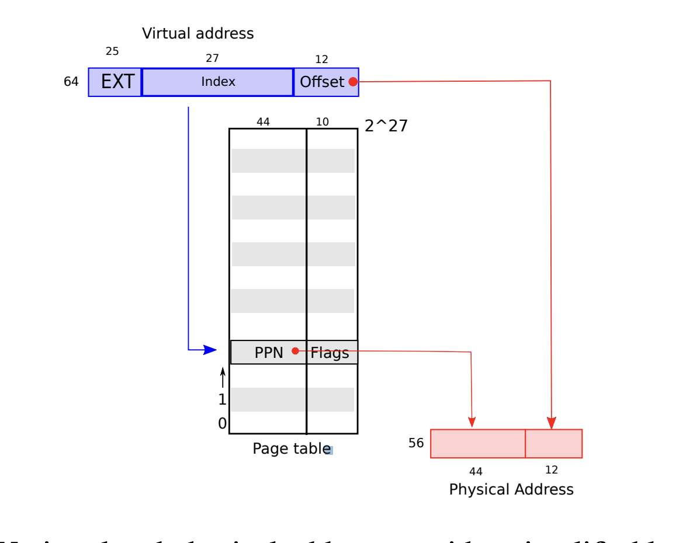
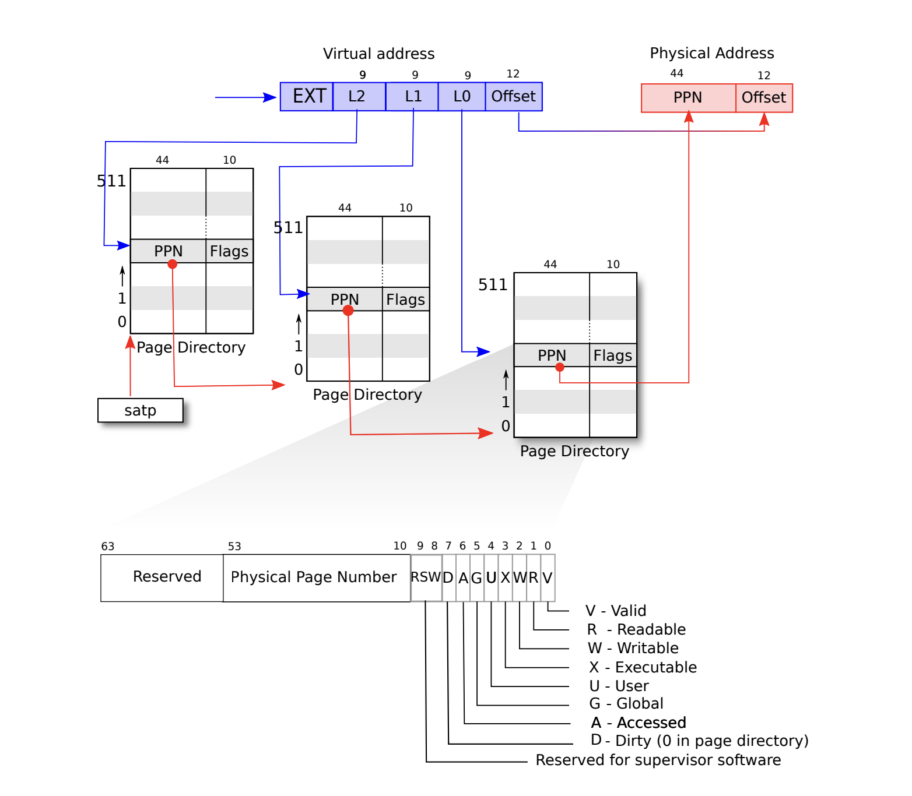

# Виртуальная память + mmap

Тема чуть тяжелая, но мега интересная. Надеюсь, вам понравится.

По традиции:
- Ридинг Печатнова (там больше про санитайзеры да валгринды) https://github.com/yuri-pechatnov/caos/tree/master/caos_2020-2021/sem12-mmap-instrumentation
- Ридинг Яковлева https://github.com/victor-yacovlev/fpmi-caos/tree/master/practice/mmap

## Зачем об этом говорить?
Помним, что на прошлых семинарах мы разобрались как так выходит, что ядро выполняет привилегированный код и менеджит все ресурсы компьютера, давая нам единственный интерфейс для взаимодействия с ядром (системные вызовы + user/privileged mode). 
Мы разобрались как сделать так, чтобы несколько программ могли исполняться конкурентно (грубо: часы+планировщик+процессы). 

Но в нашей картине мира у процессов до сих пор есть доступ к физической памяти, и мы пока не придумали каким образом изолировать процессы друг от друга, и самое главное как сделать так, чтобы у процессов не было бы доступа к памяти, с которой работает ядро.

## Виртуальные адреса
Введём так называемые виртуальные адресные пространства: у каждого процесса своя память, он может в неё писать и читать, она каким-то образом будет мапиться в физическую, не зная о том, что творится у дргих процессов.

Функционал "трансляции" виртуального адреса в физический реализован на уровне процессора при помощи специальных устройств, которые называются [MMU](https://en.wikipedia.org/wiki/Memory_management_unit).

Если очень просто: каждый раз когда планировщик ставит процесс на исполнение (context switching), сохраняется состояние процесса: все пользовательские регистры, указатель на вершину стека, а ещё некоторый регистр (CR3 на x86, satp на RISC-V), в котором есть **физический адрес** таблицы адресов (пока что пофиг какая она). Когда мы делаем некоторую инструкцию, которая подгружает какую-то память, мы ходим в какой-то адрес, инструкция с этим адресом попадает на исполнение,  MMU смотрит в табличку адресов и выдаёт нам данные с соответствующего физического адреса, о котором мы не знаем. 

Очевидно, что не самая лучшая затея хранить для каждого виртуального адреса маппинг в физический, табличка будет очень большой.

## Фрагментация и paging
До сих пор разобрались в том, что виртуальные адреса+MMU дают нам возможность изолировать процессы, но каким образом эту самую память выделять?

Если просто выделять память теми кусками, которыми нам заблагорассудится, появится так называемая проблема [фрагментации](https://en.wikipedia.org/wiki/Fragmentation_(computing)). Простыми словами: это ситуация, в результате которой общий объем доступной памяти достаточно большой, но программа всё равно завершается с ошибкой, потому что нет ни одного достаточно большого свободного блока. 

В линуксе всё решается следующим образом: просто выделается память кусками одинакового размера(страничками, обычно 4096 байт). Тут есть некоторый трейдофф - если нам нужно выделить пару байт, для нас всё равно выделится 4кб страничка в памяти.

А табличка, в которой у нас происходит этот самый маппинг виртуальный адресов в физические называется Page Table, то что в ней лежит - PTE (page table entry).

Ниже очень простой (и плохой) пример page table. На входе виртуальный адрес, младшие 12 бит оставляем как сдвиг (странички по 4096 бит=2\*\*12), старшие 27 битов используем, чтобы поглядеть в табличку и понять где находится физический адрес. Остальные битики не используем. 

Вся прелесть виртуального маппинга состоит в том, что мы сможем замапить любые адреса, какие захотим. Давайте представим, что нужно замапить какой-нибудь адрес с очень большим индексом, ну например самую "последнюю" возмжоную страничку в нашей табличке, при этом мы не будем использовать все странички ниже.  
Тогда выходит, что нам нужно будет держать таблицу размера 2**27, даже если использовать мы будем только использовать только одну страничку. Размер этой таблицы будет `54*2**27` ~ 1 гигабайт, чисто на Page table на один процесс. Это слишком много!

Сделаем вторую итерацию:

Тут табличка из одноуровневой превращается в многоуровневую (они уже называются Page Directories). И каждая табличка хранит список уровня ниже. Табличка самого низкого уровня хранит указатль на физический адрес нужной нам таблички в памяти. 

Теперь по пунктам, представляем себе что мы процессор и нам прилетает такой адрес `0b111111111222222222333333333444444444444`.  
Мы должны будем подгрузить нужную страничку из памяти.

1. Берём из регистра `CR3` (`SATP` в xv6) адрес верхоуровневого Page Directory. 
2. Из первых девяти битиков `0b111111111` берём индекс и находим в L2 page directory адрес таблички следующего уровня.
3. Адрес таблички следующего уровня + вторые девять бит как индекс - адрес следующей PD.
4. По той же логике берём индекс + из третьей девятки битиков и находим физический адрес уже страницы из памяти, и используем offset, чтобы сдвинуться на нужное количество байт.

Тут можно заметить несколько приколов: в ситуации как в прошлый раз, где нам нужно выделить "большой" адрес, мы максимально будем юзать размер трёх page directories, а тут получается совсем не гигайбайт, а какие-то жалкие три по 512*54 бит (на самом деле умножаем на 64 ,потому что машинное слово). А ещё как раз получается, что page directory вмещается в физическую страничку памяти. Получается, что если мы выделяем мало памяти, то PD будут сильно меньше чем в случае с одним page table, а если памяти будет выделяться много, то места эти таблички будут занимать столько же.

https://github.com/david-slatinek/c-read-vs.-mmap

## (TLB) Translation Look-Аside Buffer
Если бы мы просто полагались на механизм поиска страниц по виртуальному адресу, получалось бы, что для каждого обращения к какому-то адресу у нас появляются накладные расходы в виде доступа к минимум двум другим адресам. Это не очень хорошо, поэтому умные люди, в дополнение к MMU создали ещё одно специальное устройство, которое называется **TLB** (Translation Look-Aside Buffer)  (обычно часть MMU). Теперь, каждый раз, когда нам нужно получить доступ к какой-то памяти, MMU посмотрит в TLB, если адрес найдётся, то мы просто будем писать туда, а иначе (получаем cache miss) сделаем лукап памяти и подгрузим адрес в TLB.

## Page fault 
Мы уже с вами люди образованные и понимаем, что память ядро выделяет кусочками по 4кб (обычно), а не столько сколько просим мы. Теперь нужно осознать ещё одну вещь: когда мы выделяем память (тем же маллоком), странички для этой памяти помечаются как выделенные, но самой аллокации памяти не происходит, она происходит только в момент, когда мы к памяти обращаемся. Это работает при помощи механизма Page fault-ов. Про page faultы можно думать как про обычную панику, которую ядро умеет ловить и как-то обрабатывать в зависимости от вводных.

Опять же очень простая ситуация: вот мы выделили какую-то память память, ядро пометило странички как занятые, потом мы к ним обратились. 

В этот момент ядро получило по макушке page fault-ом и поняло, что эту память на самом деле она не выделяла, а вот пользователь в неё полез. 
Ок, мы берём и смотрим, а ~~был ли мальчик~~ маллочил ли пользователь эту память?  
Если да, то обрабатываем эту панику и аллоцируем нужную память и позволяем пользователю писать.  
А если нет, то выкидываем какую-то ошибку типа сегфолта и  спокойно живём себе дальше.

Изначально механизм пейджфолтов может звучать как какой-то бред, но на самом деле штука очень красивая и позволяет дофигищу разных ситуаций хендлить (даже Copy-on-Write при форке, который обсудим дальше).

Например, мы можем замапить файл на память, а потом начать его читать. В момент когда мы файл замапили на память, мы взяли и проставили в табличках адресации все нужные маппинги, но файл не подгружали (он может банально в память не поместиться). А в момент когда начинаем ходить по файлу, получаем page faultы, подгружаем нужные 4кб файла и идём дальше.

## Права+странички
На рисунках выше можно обратить внимание на то, что помимо PPN (physical page number), есть ещё и какие-то флаги. Это флаги, в которых прописано что можно делать с конкретно этой страничкой в памяти. Можно например выделить страничку, из которой можно только читать (секция rodata зашла в чат), а можно делать страничку, из которой можно читать и исполняться, но запрещено писать (секция text), а ещё можно только читать и писать, но нельзя исполняться (.data). 

Среди флагов есть и, например, privileged, если он проставлен, то в страницу доступ будет только в прилигерованном режиме, читай из адресного пространства ядра.

## Как мапить файлы в память
Рекомендую перед чтением примеров и нулёвок залететь и посмотреть документацию сисколла mmap вот тут: https://man7.org/linux/man-pages/man2/mmap.2.html

Теперь смотрим пример и проникаемся тем, как классно можно читать из файла просто инкремнтя указатель: `mmap.c`

