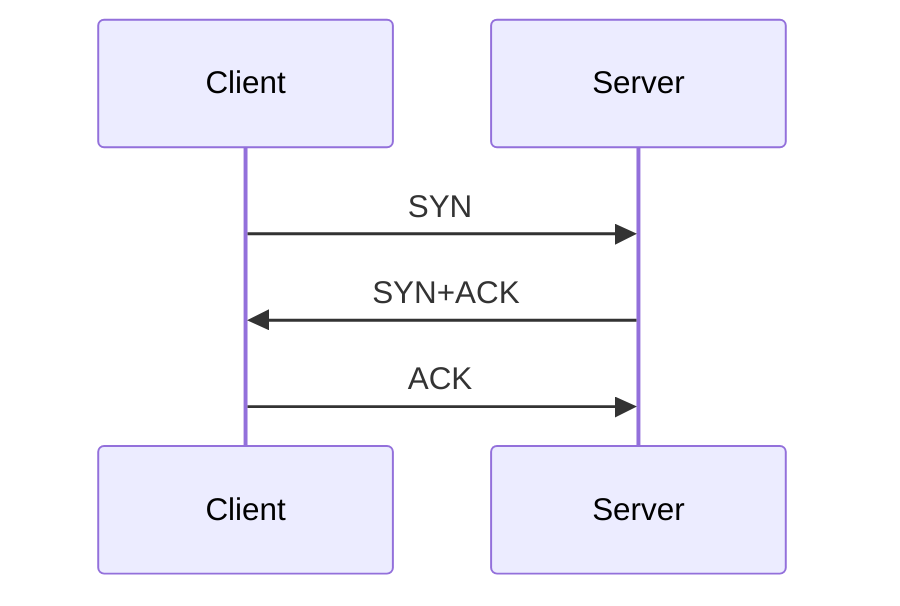

# Сети: UDP+TCP

# OSI Model 
Open Systems Interconnection model - концептуальная модель из 7 абстрактных слоёв, цель которой описать взаимодействие по сети, начиная от передачи битов в какой-то среде (самый низкий уровень), заканчивая представлением этих самых данных в некотором приложении (самый высокий уровень). 

Каждый слой имеет свои точно определённые функции и, возможно, описывает какое-то взаимодействие со слоями ниже/выше.

## Уровни модели OSI
*~~фазан купил сосиску...~~ All People Seem To Need Data Processing*


| Уровень      | Описание |  Примеры |
| ----------- | ----------- |------|
| Физический (Physical)    |  | wifi, bluetooth, rj45, etc| 
| Канальный (Data-Link)    | node-to-node frame transfer, иногда находит и исправляет ошибки | это скорее подуровни: mac+llc |
| Сетевой (Network)        | logical host-to-host communication, два хоста общаются, не знают про data-link&physical | ipv4, ipv6 |
| Транспортный (Transport) | end-to-end communications for applications | udp, tcp |
| Сесионный (Session)      | пофиг на него | аутентификация, авторизация |
| Представительский (Presentation)   | тоже пофиг |  |
| Прикладной (Application)   |  communicating with host-based and user-facing applications | http(s), dns (такое), ssh, dhcp (тоже такое) |

Очень много всего интересного происходит на канальном уровне, его правда стоит изучить, но у нас, к сожалению, на него времени не остаётся. В ссылках укажу ресурсы для тех, кому интересно.

## TCP/IP модель, войны стандартов
*[Protocol Wars](https://en.wikipedia.org/wiki/Protocol_Wars) occurred from the 1970s to the 1990s when engineers, organizations and nations became polarized over the issue of which communication protocol would result in the best and most robust computer networks.*

https://www.internethalloffame.org/2015/11/12/untold-internet-internet-osi-standards-wars/

https://habr.com/ru/post/376709/


В модели Internet protocol suite четыре уровня: Application layer, Transport layer, Internet layer, Link layer

Смотрим картинку 


## Сетевой уровень
Интернет и устройства, подключенные к нему, можно изобразить в виде графа. Задача протоколов и устройств, работающих на сетевом уровне - найти маршрут и передать нужную *датаграмму* (содержающую информацию, релевантную на уровнях выше: транспортном, сессионном и тд) с хоста А на хост B. 

Как это делать надёжно, отказоустойчиво, не теряя при этом пакеты и не переупорядочивая их по дороге? В случае IP, в общем-то, никак. Именно поэтому протокол IP называют best-effort delivery network service, или тип обслуживания сети с негарантированной доставкой.  https://ru.wikipedia.org/wiki/%D0%9D%D0%B5%D0%B3%D0%B0%D1%80%D0%B0%D0%BD%D1%82%D0%B8%D1%80%D0%BE%D0%B2%D0%B0%D0%BD%D0%BD%D0%B0%D1%8F_%D0%B4%D0%BE%D1%81%D1%82%D0%B0%D0%B2%D0%BA%D0%B0

### IP адрес
В первом приближении это 32-битная чиселка, которая идентифицирует **интерфейс** некоторого устройства в какой-то сети. 

Почему интерфейс, а не машину? Потому что у одной машины может быть несколько интерфейсов, каждый из которых может быть подключен к какой-то сети (необязательно одной и той же).

Теперь к интернету -- интернет это глобальная сеть компьютеров, в которой каждый подключенный интерфейс должен иметь некоторый уникальный IP-адрес. Можно ли просто забрать себе некоторый айпишник и им пользоваться? Оказывается, что нет.

Существует такая организация, называется IANA (Internet Assigned Numbers Authority) - эти ребята координируют раздачу IP-адресов на уровни инже. Они выдают диапазоны IP-адресов т.н. RIR (Regional Internet Registries), которые в свою очередь раздают диапазоны поменбше большим компаниям, правительствам, универам и т.д. Те в свою очередь раздают эти айпишники другим компаниям и так, спустя несколько уровней ваш домашний рутер получит заветный айпи адрес. 

А как происходит это разделение диапазонов айпи адресов? Айпишников, если они 32-битные, может быть 4 миллиарда, про 128 битные IPv6 я вообще молчу. Давайте глянем на структуру айпишника

```
11011111 00000001 00000001 00000001 - такой айпишник преобразуется в 223.1.1.1
```

Упрощаем всё до безобразия: представим себе, что мы интернет провайдер, небольшой, тогда нам выдадут некоторую "подсеть" из айпишников, эта подсеть будет адресоваться следующим образом `223.1.1.0/24` (это ещё называется маской подсети). Это значит, что конкретная сеть будет менеджить все айпишники, которые попадают в этот диапазон. При этом первые 24 чиселки всех интерфейсов внутри этой сети будут одинаковые. Ну, и, например, `223.1.1.2`, `223.1.1.3` и тд до `223.1.1.255` будут частью этой сети. Так это работает на уровнях выше, вплоть до RIR и IANA, которые эти айпишники раздают (ну или раздавали).

У этих правил, конечно же, есть исключения, и всё не так просто, но базово распределение айпи адресов работает именно так.

И примерно по такому же принципу работают сети локальные: айпишники в сети универа, телефоны, подключенные к вайфаю или серверные тачки в кубернетесе. 

192.168..... (кулстори про сисадмина и айпиадреса?)

Окей, скажете вы, тогда появляется новый вопрос - почему, если у каждого устройства в интернете должен быть свой уникальный адрес, когда я выхожу в интернет со своего мобильного телефона и компа с домашнего вайфая, публичный айпишник один и тот же? 

Ответ: NAT - Network Address Translation, который есть в каждом роутере. Он сопоставляет доступному снаружи порту вашего роутера внутренний сетевой айпишник  и перенаправляет трафик идущий снаружи на какой-то порт во внутреннюю сеть. Таким образом, ваша умная лампочка обходится без IPv4 адреса во всемирной сети (а вот обойдётся ли она без IPv6???).

Ещё одна проблема: челики, которые делали интернет в семидесятых не учли, что инет надо будет проводить к каждому утюгу, поэтому прикинули (реально, я не шучу), что в каждой стране будет по два провайдера (конкуренция, ага), к каждому провайдеру будет подключено по 500 компов, количество стран оценили 128 (степень двойки, опять же, это не шутка) и подумали, что 4 миллиардов адресов будет более достаточно. Не тут-то было: в 2011 году официальным образом все IPv4 адреса закончились, и по-тихоньку (на самом деле раньше 2011-го) начался переход на адреса IPv6, которые уже 128-битные (на десяток лет должно хватить).

Я совру, если скажу, что единственное отличие протокола IPv4 от IPv6 - длина адресов, но интересующиеся ребята нагуглят, если им будет важно узнать про другие отличия.

```
    0                   1                   2                   3
    0 1 2 3 4 5 6 7 8 9 0 1 2 3 4 5 6 7 8 9 0 1 2 3 4 5 6 7 8 9 0 1
   +-+-+-+-+-+-+-+-+-+-+-+-+-+-+-+-+-+-+-+-+-+-+-+-+-+-+-+-+-+-+-+-+
   |Version|  IHL  |Type of Service|          Total Length         |
   +-+-+-+-+-+-+-+-+-+-+-+-+-+-+-+-+-+-+-+-+-+-+-+-+-+-+-+-+-+-+-+-+
   |         Identification        |Flags|      Fragment Offset    |
   +-+-+-+-+-+-+-+-+-+-+-+-+-+-+-+-+-+-+-+-+-+-+-+-+-+-+-+-+-+-+-+-+
   |  Time to Live |    Protocol   |         Header Checksum       |
   +-+-+-+-+-+-+-+-+-+-+-+-+-+-+-+-+-+-+-+-+-+-+-+-+-+-+-+-+-+-+-+-+
   |                       Source Address                          |
   +-+-+-+-+-+-+-+-+-+-+-+-+-+-+-+-+-+-+-+-+-+-+-+-+-+-+-+-+-+-+-+-+
   |                    Destination Address                        |
   +-+-+-+-+-+-+-+-+-+-+-+-+-+-+-+-+-+-+-+-+-+-+-+-+-+-+-+-+-+-+-+-+
   |                    Options                    |    Padding    |
   +-+-+-+-+-+-+-+-+-+-+-+-+-+-+-+-+-+-+-+-+-+-+-+-+-+-+-+-+-+-+-+-+
   |                           Data...                             |
   +-+-+-+-+-+-+-+-+-+-+-+-+-+-+-+-...

                    Example Internet Datagram Header
```

## Транспортный уровень
Два дома, по в каждой по эн детей, каждый шлёт письмо в другой дом, есть два ответственных за доставку почту детям. Почта - сетевой уровень, челы ответственные за доставку писем - транспортный уровень

### UDP

#### Структура пакета UDP
```
 0      7 8     15 16    23 24    31
+--------+--------+--------+--------+
|     Source      |   Destination   |
|      Port       |      Port       |
+--------+--------+--------+--------+
|                 |                 |
|     Length      |    Checksum     |
+--------+--------+--------+--------+
|
|          data octets ...
+---------------- ...

    User Datagram Header Format

```

#### Чексумма
Как проверят целостность пакетов при приёме? 

Пример: Алиса отправляет три байта:
```
10010110 + <--- 1) складываем, откидываем старшую часть
11100101 +
10100111 +
--------- 
00100010 --> 2) берём дополнение 11011101 -- это наша чексумма
```

Отправляем три байта, вместе с чексуммой Бобу:
```
10010110 + <- байт 
11100101 + <- байт 
10100111 + <- байт 
11011101 + <- чексумма
--------
11111111 <- бинго!
```


### TCP

### 3-way handshake

TCP это протокол для обмена инфой между двух каких-то устройств. Чтобы мы могли правильно подтверждать доставку, нужно убедиться, что сервер принял подключение клиента, а клиент принял подключение сервера. Те правильно было бы мутить вот такую схему: 
```
client  --req--> server
client <--ack--  server |
client <--req--  server | <-- заметили что ack+req можно заменить просто одним сообщением
client  --ack--> server
```
https://networkengineering.stackexchange.com/questions/24068/why-do-we-need-a-3-way-handshake-why-not-just-2-way

Ну а теперь давайте попробуем заменить req на syn от слова synchronize (initial sequence number).
Получается 3way handshake: клиент отправляет SYN, сервер отправляет SYNACK , клиент отправляет ACK



### Acks+pipelining+sliding windows+automatic repeat request
схемку стырил [отсюда](https://www.saminiir.com/lets-code-tcp-ip-stack-3-tcp-handshake/)
```
        Left window edge             Right window edge
            |                             |
            |                             |
---------------------------------------------------------
...|    3    |    4    |    5    |    6    |    7    |...
---------------------------------------------------------
        ^     ^                            ^    ^
        |      \                          /     |
        |       \                        /      |
    Sent and           Window size: 3         Cannot be
    ACKed                                     sent yet
```

Если очень коротко, то плавающее окно позволяет нам высылать несколько пакетов сразу, менять размер окна в зависимости от пропускной способности канала и сразу понимать какие сообщения были доставлены, а какие нет. 


Давайте представим себе такую ситуацию

```
initial data: 1 2 3 4 5 6
             [     ]
c  -- 1 --> s  <--- первое "окно"
c  -- 2 --> s 
c  -- 3 х   s 

data: 1 2 3 4 5 6 
         [     ]
s <-- 1 --  s (ack)
s <-- 2 --  s (ack)
// 
... (no ack for the packet "3")

c  -- 3 --> s  <--- второе "окно" можно заметить что произошёл ретрансмит
c  -- 4 --> s 
c  -- 5 --> s 
```

Как это работает на практике?

```
0                            15                              31
-----------------------------------------------------------------
|          source port          |       destination port        |
-----------------------------------------------------------------
|                        sequence number                        |
-----------------------------------------------------------------
|                     acknowledgment number                     |
-----------------------------------------------------------------
|  HL   | rsvd  |C|E|U|A|P|R|S|F|        window size            |
-----------------------------------------------------------------
|         TCP checksum          |       urgent pointer          |
-----------------------------------------------------------------
```

У каждого пакетика, есть номер последовательности и номер ака. Соответственно, что сервер, что клиент пересылают такие пакеты и другая сторона знает что произошло: если это ак, то будет стоять соответствующий флаг и в поле ака будет его номер , ну и так далее.

Как закрываются подключения

В отличие от открытия подключения, тут будет две пары пакетов:
- закрывальщик отправляет FIN
- сервер ACK
- потом сервер FIN, когда закончил отправлять пакетики 
- потом закрывальщик ACK


гайд по примерчикам:
простой tcp сервер, демонстрация http
non-blocking io: remote server + sleepy server, blocking, non_blocking multiple connections
epoll example


Список функций и что они делают: 
```
#include <arpa/inet.h>

in_addr_t inet_addr(const char *cp);
char *inet_ntoa(struct in_addr in);
```

The `in_port_t` and in_addr_t types shall be defined as described in <netinet/in.h>.

Ещё важные функции 
В сети адреса биг ендиан, на ваших тачках нет (скорее всего). Функции ниже позволяют переходить от одного формата к другому.

https://beej.us/guide/bgnet/html/#close-and-shutdownget-outta-my-face

```
htonl() translates an unsigned long integer into network byte order.
htons() translates an unsigned short integer into network byte order.
ntohl() translates an unsigned long integer into host byte order.
ntohs() translates an unsigned short integer into host byte order.
```
http://www.kegel.com/c10k.html#nb


# Демки
- `mtr (не мак)` man в помощь
-  `nc -l 1234`, `nc 127.0.0.1 1234` , печатаем что-то в одному окошке, видим в другому
- быстрый сервер на питоне `python -m http.server --bind 0.0.0.0 8080`
- отправляем что-то через неткат на сервер: ``echo -n "GET / http/1.1\r\n\r\n" | nc localhost 8000
- сканируем порты `nc -z <ip> <port_from>-<port_to>`
- iptables firewall в линухе, больше [тут](https://www.digitalocean.com/community/tutorials/how-to-list-and-delete-iptables-firewall-rules)
  - `sudo iptables -A INPUT -p tcp --dport 8082 -j DROP` дропаем все tcp пакеты на 8082 порт
  - `sudo iptables -L` смотрим все правила фаерволла
- `lsof -i4:8080` смотреть какие процессы слушают 8080 порт, обратите внимание на флаги `-P`, `-t`
- tcpdump, про него можно почитать [тут](https://danielmiessler.com/study/tcpdump/#source-destination)
    - `sudo tcpdump -c1 -X icmp` - ловим icmp траффик
    - можно прикольнуться и заблочить все пакеты которые отправляются после установки tcp соединения вот так `sudo iptables -A INPUT  -m state --state ESTABLISHED  -s google.com -j DROP`, запустить `tcpdump host google.com`  и в соседнем окне сделать `curl google.com` и увидеть в дампе хендшейк+ретраи на запросы для недошедших пакетов в tcp


<!-- HTTP
- method: POST, PUT, GET, DELETE, OPTIONS
- headers: cookie, content-type ...
- cookies: tracking, login info etc
- curl
- simple http server (python)
- browser dev tools demo 

байка про vincent cerf

DNS lookup  as part of http, dns server demo? the story about the guy sitting adding new names for ip addresses

ICMP, UDP, TCP, HTTP1/2/3, HTTPS, QUIC, IP, 
Browser DevTools
netcat, nslookup, tcpdump, wireshark

-->